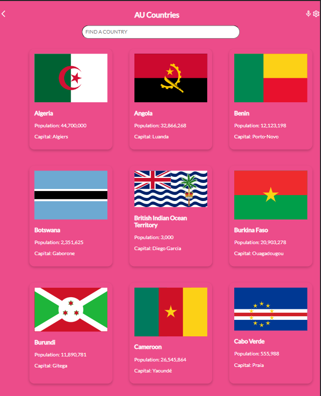
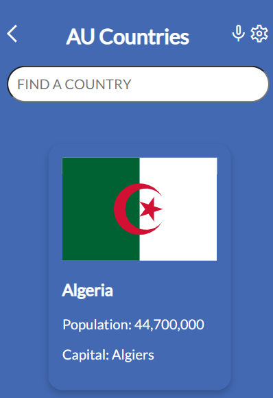
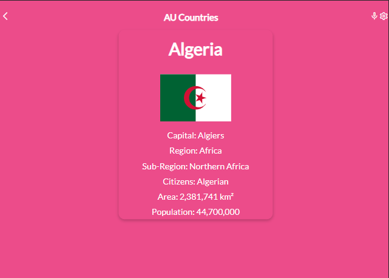
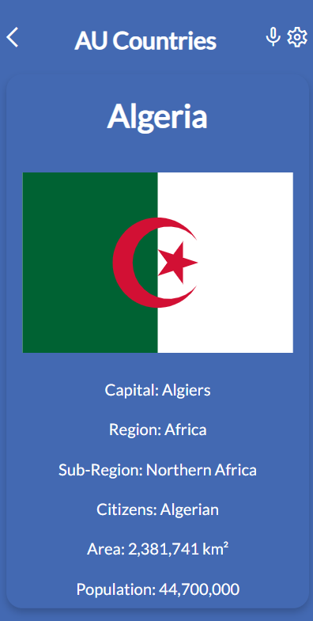

<a name="readme-top"></a>

<div align="center">
  
  <br/>

  <h1><b>African Union</b></h1>

</div>


# 📗 Table of Contents

- [� Table of Contents](#-table-of-contents)
- [📖 African Union](#-about-project)
  - [🛠 Built With ](#-built-with-)
    - [Tech Stack ](#tech-stack-)
    - [Key Features ](#key-features-)
  - [📷 Screenshot](#-screen-shot-)
  - [🎥 Video Demo](#-video-demo-)
  - [🚀 Live Demo ](#-live-demo-)
  - [💻 Getting Started ](#-getting-started-)
    - [Prerequisites](#prerequisites)
    - [Setup](#setup)
    - [Install](#install)
    - [Usage](#usage)
    - [Run tests](#run-tests)
    - [Deployment](#deployment)
  - [👥 Authors ](#-authors-)
  - [🔭 Future Features ](#-future-features-)
  - [🤝 Contributing ](#-contributing-)
  - [⭐️ Show your support ](#️-show-your-support-)
  - [🙏 Acknowledgments ](#-acknowledgments-)
  - [❓ FAQ (OPTIONAL) ](#-faq-optional-)
  - [📝 License ](#-license-)

<!-- PROJECT DESCRIPTION -->

# African Union <a name="about-project"></a>

The African Union App is a mobile web application that allows users to view a list of countries in the AU. The webapp has two pages: the home page and the details page. The home page displays a list of countries that can be filtered by country name. When the user clicks on a country, the application navigates to the details page.

## 🛠 Built With <a name="built-with"></a>

### Tech Stack <a name="tech-stack"></a>

<details>
  <summary>Client</summary>
  <ul>
    <li><a href="https://reactjs.org/">React.js</a></li>
  </ul>
</details>

<details>
  <summary>Webpack</summary>
  <ul>
    <li><a href="https://expressjs.com/">Webpack</a></li>
  </ul>
</details>

<details>
<summary>Database</summary>
  <ul>
    <li><a href="https://restcountries.com/v2/regionalbloc/au">African Union</a></li>
  </ul>
</details>

<!-- Features -->

### Key Features <a name="key-features"></a>

- Home page
  - When the page loads, the webapp shows the list of categories that could be filtered out by the country name.
  - Along with the category name, you will display some numeric values per category that come from the API.
  - When the user clicks (or taps) on a category item, the application navigates to the details page.

- Details page
  -  In the details page, the webapp retrieves data from the API to show detailed data in the category.
  -  When the user clicks on the "Back" button (<), the user navigates to the home page.

<p align="right">(<a href="#readme-top">back to top</a>)</p>

<!-- LIVE DEMO -->

## 📷 Screenshot <a name="screen-shot"></a>

 <div align="center">
  
  
  
  
 </div>

<p align="right">(<a href="#readme-top">back to top</a>)</p>


## 🎥 Video Demo <a name="video-demo"></a>

 [African Union](https://www.loom.com/share/f4787c57c5f8477f88a81a8da8504b5d)

<p align="right">(<a href="#readme-top">back to top</a>)</p>


## 🚀 Live Demo <a name="live-demo"></a>

 [African Union](#)

<p align="right">(<a href="#readme-top">back to top</a>)</p>

<!-- GETTING STARTED -->

## 💻 Getting Started <a name="getting-started"></a>


To get a local copy up and running, follow these steps.

### Prerequisites

In order to run this project you need:


```bash
 A web browser- Google Chrome.
 A code editor- Visual Studio Code with Git and Node.js.
```


### Setup

Clone this repository to your desired folder:


```bash
  git clone git@github.com:elarhadu/African-Union.git
  cd African-Union
```


### Install

Install this project with:


```bash
  npm install
```


### Usage

To run the project, execute the following command:


```bash
  npm start
```


### Run tests

To run tests, run the following command:


```bash
  npm test
```


### Deployment

You can deploy this project using:


```bash
npm run build
```


<p align="right">(<a href="#readme-top">back to top</a>)</p>

<!-- AUTHORS -->

## 👥 Author <a name="authors"></a>

👤 **Emmanuella Adu**

- GitHub: [@elarhadu](https://github.com/elarhadu)
- Twitter: [@elarh_](https://twitter.com/elarh_)
- LinkedIn: [Emmanuella Adu](https://linkedin.com/in/emmanuella-adu)

<p align="right">(<a href="#readme-top">back to top</a>)</p>

<!-- FUTURE FEATURES -->

## 🔭 Future Features <a name="future-features"></a>
- Add other continent union countries

<p align="right">(<a href="#readme-top">back to top</a>)</p>

<!-- CONTRIBUTING -->

## 🤝 Contributing <a name="contributing"></a>

Contributions, issues, and feature requests are welcome!

Feel free to check the [issues page](../../issues/).

<p align="right">(<a href="#readme-top">back to top</a>)</p>

<!-- SUPPORT -->

## ⭐️ Show your support <a name="support"></a>


If you like this project, please give it a ⭐️

<p align="right">(<a href="#readme-top">back to top</a>)</p>

<!-- ACKNOWLEDGEMENTS -->

## 🙏 Acknowledgments <a name="acknowledgements"></a>


I would like to thank [Microverse](https://github.com/microverseinc) and Nelson Sakwa for providing the wireframe for this project.

<p align="right">(<a href="#readme-top">back to top</a>)</p>


<!-- LICENSE -->

## 📝 License <a name="license"></a>

This project is [MIT](./LICENSE) licensed.


<p align="right">(<a href="#readme-top">back to top</a>)</p>
